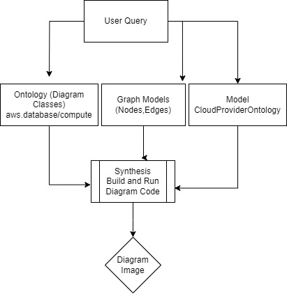

# Agentic AI Diagrams/Graph Cloud Architect Challenge
by: Amit Sides

This is a challenge for teaching LLM to generate Cloud Topology Diagram using hybrid KG/Ontology Oriented, Graph and Model based approach with User Query.

- Cloud Provider ontology Extraction (see ontology/aws.json example) from https://github.com/mingrammer/diagrams/tree/master/docs/nodes and generated CloudProviderOntology Class as - Example of the Class of the Diagram Nodes in https://diagrams.mingrammer.com/docs/guides/node 
- class DiagramAgent calls VertexAI to return CloudProviderOntology based on User Query
- The mapping between Diagrams Nodes Python Classes and the Nodes of the Json that return from LLM should be handled
- The Bi-Directional Relationship between Graph as in GraphComponents and the Diagrams Implementation in: https://github.com/mingrammer/diagrams/blob/master/docs/getting-started/examples.md 

# The Solution and it's Logic
This logic allows you to Parse Cloud Resources, Map Then into Graph and turn the Graph into Diagram.

## Example 
Extract from User Query (aws_network,    aws_compute,    aws_database,    aws_integration,    aws_analytics,    aws_management   ) load Diagram Imports from ontology and either generate code using DiagramBuilder, or turn Graph to Diagram. you can also use LLM to generate Diagram Code (implement any synthesis mechanism).

# TBD
Turn All Cloud Providers from
https://github.com/mingrammer/diagrams/tree/master/docs/nodes
into JSON Ontology KG of Diagram Imports

# Fast API
FastAPI can Expose the Agent (see fastapi.py)
